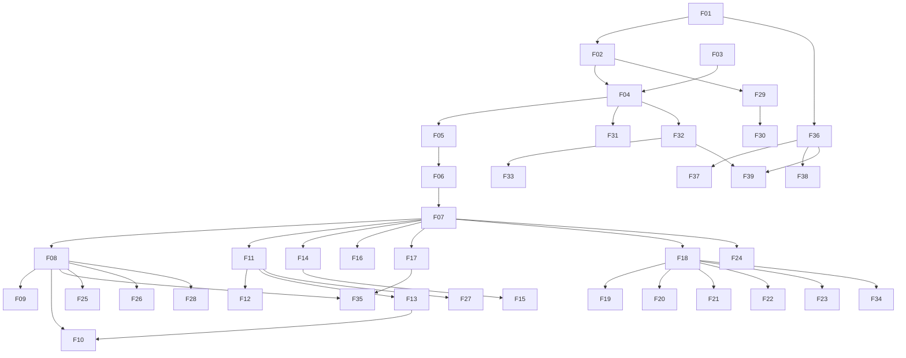

# Бэклог фич singctl для Spec Kit

Разбивка [продуктового ТЗ](./tz/singularityapp-cli-tui-tz.md) на мелкие фичи.
Каждая строка — **один** цикл Spec Kit:

`/speckit-specify` → `/speckit-clarify` → `/speckit-plan` → `/speckit-tasks` → `/speckit-implement`

Это **входной** документ (как ТЗ и `coverage.md`), а не замена артефактов в `specs/`. Каталоги `specs/<NNN>-*/` создаются только командами Spec Kit.

**Статус:** `pending` → после specify статус меняется вручную на `specified` / `done` и появляется путь `specs/…`.

Общие входы почти для всех фич:

- `.specify/memory/constitution.md`
- `docs/tz/singularityapp-cli-tui-tz.md`
- `docs/api/coverage.md`
- `docs/api/openapi.yaml`

---

## Как запускать specify

1. Выбрать **одну** фичу из очереди (учитывая Depends).
2. В Agent mode вызвать `/speckit-specify` и передать краткое описание + пути из колонки «Входы» / шаблон ниже.
3. Не смешивать несколько Fxx в одном `spec.md`.
4. Для entity-фичей сверяться с матрицей всех 51 operations в `docs/api/coverage.md`.

Шаблон промпта:

```text
/speckit-specify <название фичи из бэклога>

Feature ID: Fxx
Scope: <in scope из карточки>
Out of scope: <out of scope>
Inputs: <пути из карточки>
Constraints: .specify/memory/constitution.md
```

---

## Рекомендуемая очередь

| Order | ID | Слой | Suggested slug | Depends | Status |
|---|---|---|---|---|---|
| 1 | F01 | A | cli-skeleton | — | pending |
| 2 | F02 | A | config-token | F01 | pending |
| 3 | F29 | E | credential-security | F02 | pending |
| 4 | F30 | E | secure-config-env | F02, F29 | pending |
| 5 | F03 | A | openapi-codegen | F01 | pending |
| 6 | F04 | A | api-adapter-auth | F02, F03 | pending |
| 7 | F05 | A | error-retry | F04 | pending |
| 8 | F06 | A | output-rendering | F01 | pending |
| 9 | F07 | A | scriptability-exits | F05, F06 | pending |
| 10 | F32 | E | unit-test-harness | F04 | pending |
| 11 | F31 | E | api-boundaries | F04 | pending |
| 12 | F08 | B | task-crud | F07 | pending |
| 13 | F09 | B | task-checklist | F08 | pending |
| 14 | F10 | B | task-kanban-move | F08, F13* | pending |
| 15 | F11 | B | project-crud | F07 | pending |
| 16 | F12 | B | project-sections | F11 | pending |
| 17 | F13 | B | project-columns | F11 | pending |
| 18 | F14 | B | habit-crud | F07 | pending |
| 19 | F15 | B | habit-progress | F14 | pending |
| 20 | F16 | B | tag-crud | F07 | pending |
| 21 | F17 | B | time-crud | F07 | pending |
| 22 | F35 | E | openapi-coverage-gate | F08…F17 | pending |
| 23 | F33 | E | integration-tests | F08…F17, F32 | pending |
| 24 | F18 | C | tui-shell | F07 | pending |
| 25 | F19 | C | tui-tasks | F18, F08–F10 | pending |
| 26 | F20 | C | tui-projects | F18, F11–F13 | pending |
| 27 | F21 | C | tui-habits | F18, F14–F15 | pending |
| 28 | F22 | C | tui-tags | F18, F16 | pending |
| 29 | F23 | C | tui-time | F18, F17 | pending |
| 30 | F34 | E | tui-model-tests | F18 | pending |
| 31 | F24 | D | shell-completions | F07 | pending |
| 32 | F25 | D | command-aliases | F08…F17 | pending |
| 33 | F26 | D | interactive-forms | F08, F11, F16 | pending |
| 34 | F27 | D | local-cache | F11, F16 | pending |
| 35 | F28 | D | quick-add | F08, F11, F16 | pending |
| 36 | F36 | E | goreleaser-build | F01 | pending |
| 37 | F37 | E | packaging-install | F36 | pending |
| 38 | F38 | E | docs-man | F08…F17 | pending |
| 39 | F39 | E | ci-pipeline | F32, F36 | pending |

\*F10 логически нуждается в колонках (F13); при желании `task move` можно специфицировать после F13.

Технические фичи F29–F35 **не ждут конца продукта**: F29/F30 — сразу после F02; F32 — вместе с первой entity-фичей; F35 — когда закрыты entity CLI.

---

## Слой A. Фундамент (Phase 1 / MVP)

### F01. CLI skeleton

| | |
|---|---|
| **Slug** | `cli-skeleton` |
| **Depends** | — |
| **In scope** | `cobra`/`viper` root, глобальные флаги `--config`, `--token`, `--output`, `--no-color`, `--debug`; структура `cmd/`; версия / `--help` |
| **Out of scope** | команды сущностей, TUI, сетевые вызовы |
| **Входы** | ТЗ §4, §6 (шапка); constitution II, IV |
| **Апрув** | `singctl --help` / `singctl version`; флаги парсятся; нет entity-команд |

**Промпт (copy-paste):**

```text
/speckit-specify F01 CLI skeleton

Feature ID: F01
Slug: cli-skeleton
Depends: —
Scope: cobra/viper root, глобальные флаги --config, --token, --output, --no-color, --debug; структура cmd/; версия и --help.
Out of scope: команды сущностей, TUI, сетевые вызовы.
Inputs:
- docs/tz/singularityapp-cli-tui-tz.md (§4, §6 шапка)
- .specify/memory/constitution.md (принципы II, IV)
Acceptance: `singctl --help` и `singctl version` работают; глобальные флаги парсятся; entity-команд нет.
Constraints: .specify/memory/constitution.md
```

### F02. Config & token storage

| | |
|---|---|
| **Slug** | `config-token` |
| **Depends** | F01 |
| **In scope** | `config set-token\|show\|validate\|set`; резолвинг конфига (флаг → XDG → `~/.config` → `./.singctl.yaml`); формат `config.yaml` |
| **Out of scope** | вызовы CRUD сущностей; маскирование токена углублённо (см. F29) |
| **Входы** | ТЗ §5 |
| **Апрув** | токен пишется/читается; `validate` при заглушке или после F04 |
| **Связь** | пересекается с **F29** (безопасность credentials) |

**Промпт (copy-paste):**

```text
/speckit-specify F02 Config & token storage

Feature ID: F02
Slug: config-token
Depends: F01
Scope: команды config set-token|show|validate|set; резолвинг конфига (флаг → XDG → ~/.config → ./.singctl.yaml); формат config.yaml.
Out of scope: вызовы CRUD сущностей; углублённое маскирование токена (см. F29).
Inputs:
- docs/tz/singularityapp-cli-tui-tz.md (§5)
- .specify/memory/constitution.md
Acceptance: токен пишется/читается; validate работает при заглушке или после F04.
Note: пересекается с F29 (безопасность credentials).
Constraints: .specify/memory/constitution.md
```

### F03. OpenAPI codegen pipeline

| | |
|---|---|
| **Slug** | `openapi-codegen` |
| **Depends** | F01 |
| **In scope** | `api/oapi-codegen.yaml`; Make-таргеты `openapi-fetch`, `generate`, `api-coverage-check`; клиент в `internal/apiclient/` (только codegen) |
| **Out of scope** | ручные HTTP-обёртки; CLI-команды |
| **Входы** | [openapi-codegen.md](./openapi-codegen.md), [makefile.md](./makefile.md), constitution III/VIII |
| **Апрув** | `make generate` создаёт клиент; coverage-check совпадает с ожиданием operations |

**Промпт (copy-paste):**

```text
/speckit-specify F03 OpenAPI codegen pipeline

Feature ID: F03
Slug: openapi-codegen
Depends: F01
Scope: api/oapi-codegen.yaml; Make-таргеты openapi-fetch, generate, api-coverage-check; клиент в internal/apiclient/ (только codegen).
Out of scope: ручные HTTP-обёртки; CLI-команды.
Inputs:
- docs/openapi-codegen.md
- docs/makefile.md
- docs/api/openapi.yaml
- docs/api/coverage.md
- .specify/memory/constitution.md (принципы III, VIII)
Acceptance: `make generate` создаёт клиент; coverage-check совпадает с ожидаемым числом operations.
Constraints: .specify/memory/constitution.md
```

### F04. API adapter & auth

| | |
|---|---|
| **Slug** | `api-adapter-auth` |
| **Depends** | F02, F03 |
| **In scope** | тонкий `internal/api/` над codegen: Bearer, base URL, timeout, маппинг ответов |
| **Out of scope** | команды CLI, retry (F05) |
| **Входы** | ТЗ §2, §5.1 |
| **Апрув** | адаптер принимает токен/URL из конфига; unit-тесты с мок-HTTP (минимум 1 happy path) |

**Промпт (copy-paste):**

```text
/speckit-specify F04 API adapter & auth

Feature ID: F04
Slug: api-adapter-auth
Depends: F02, F03
Scope: тонкий internal/api/ над codegen: Bearer-авторизация, base URL, timeout, маппинг ответов.
Out of scope: команды CLI; retry (F05).
Inputs:
- docs/tz/singularityapp-cli-tui-tz.md (§2, §5.1)
- docs/api/openapi.yaml
- .specify/memory/constitution.md
Acceptance: адаптер принимает токен/URL из конфига; unit-тесты с мок-HTTP (минимум 1 happy path).
Constraints: .specify/memory/constitution.md
```

### F05. Error handling & retry

| | |
|---|---|
| **Slug** | `error-retry` |
| **Depends** | F04 |
| **In scope** | маппинг 401/403/404/422/429/5xx; exponential backoff для 429 (3 попытки); клиентские ошибки (нет токена, дата) |
| **Out of scope** | TUI-баннеры (подхватывает F18+) |
| **Входы** | ТЗ §8 |
| **Апрув** | таблица кодов → сообщения; тесты retry на 429 |

**Промпт (copy-paste):**

```text
/speckit-specify F05 Error handling & retry

Feature ID: F05
Slug: error-retry
Depends: F04
Scope: маппинг 401/403/404/422/429/5xx; exponential backoff для 429 (3 попытки); клиентские ошибки (нет токена, неверная дата).
Out of scope: TUI-баннеры (подхватывает F18+).
Inputs:
- docs/tz/singularityapp-cli-tui-tz.md (§8)
- .specify/memory/constitution.md
Acceptance: таблица кодов → сообщения; тесты retry на 429.
Constraints: .specify/memory/constitution.md
```

### F06. Output rendering

| | |
|---|---|
| **Slug** | `output-rendering` |
| **Depends** | F01 |
| **In scope** | форматтеры `table\|json\|yaml\|csv`; авто-`no-color` в non-TTY; `date_format` |
| **Out of scope** | конкретные колонки entity (подключаются с F08+) |
| **Входы** | ТЗ §9 |
| **Апрув** | одни и те же данные рендерятся во все форматы; pipe без ANSI |

**Промпт (copy-paste):**

```text
/speckit-specify F06 Output rendering

Feature ID: F06
Slug: output-rendering
Depends: F01
Scope: форматтеры table|json|yaml|csv; авто-no-color в non-TTY; настройка date_format.
Out of scope: конкретные колонки entity (подключаются с F08+).
Inputs:
- docs/tz/singularityapp-cli-tui-tz.md (§9)
- .specify/memory/constitution.md
Acceptance: одни и те же данные рендерятся во все форматы; pipe без ANSI.
Constraints: .specify/memory/constitution.md
```

### F07. Scriptability & exit codes

| | |
|---|---|
| **Slug** | `scriptability-exits` |
| **Depends** | F05, F06 |
| **In scope** | exit codes `0/1/2/3`; stdin/pipe; stdout vs stderr |
| **Out of scope** | новые команды |
| **Входы** | ТЗ §10, constitution V |
| **Апрув** | документированные codes; pipe-сценарии из ТЗ §10 проходят на уровне контракта |

**Промпт (copy-paste):**

```text
/speckit-specify F07 Scriptability & exit codes

Feature ID: F07
Slug: scriptability-exits
Depends: F05, F06
Scope: exit codes 0/1/2/3; stdin/pipe; разделение stdout vs stderr.
Out of scope: новые команды.
Inputs:
- docs/tz/singularityapp-cli-tui-tz.md (§10)
- .specify/memory/constitution.md (принцип V)
Acceptance: документированные коды выхода; pipe-сценарии из ТЗ §10 проходят на уровне контракта.
Constraints: .specify/memory/constitution.md
```

---

## Слой B. CLI по сущностям

Покрытие API: каждая фича закрывает свой блок из [coverage.md](./api/coverage.md). Не пропускать `get` и полный CRUD подресурсов.

### F08. task CRUD

| | |
|---|---|
| **Slug** | `task-crud` |
| **Depends** | F07 |
| **In scope** | `list/get/create/update/delete` + `archive`/`trash`; фильтры `list` |
| **Out of scope** | checklist, kanban-link |
| **Входы** | ТЗ §6.1; coverage `/v2/task` |
| **Апрув** | все operations TaskController_*; CLI help; unit-тесты адаптера |

**Промпт (copy-paste):**

```text
/speckit-specify F08 task CRUD

Feature ID: F08
Slug: task-crud
Depends: F07
Scope: list/get/create/update/delete + archive/trash; фильтры для list.
Out of scope: checklist (F09), kanban-link (F10).
Inputs:
- docs/tz/singularityapp-cli-tui-tz.md (§6.1)
- docs/api/coverage.md (/v2/task, TaskController_*)
- docs/api/openapi.yaml
- .specify/memory/constitution.md
Acceptance: закрыты все operations TaskController_*; CLI help; unit-тесты адаптера.
Constraints: .specify/memory/constitution.md
```

### F09. task checklist

| | |
|---|---|
| **Slug** | `task-checklist` |
| **Depends** | F08 |
| **In scope** | CRUD `/v2/checklist-item` (`parent` = task) |
| **Out of scope** | TUI checklist UI |
| **Входы** | ТЗ §6.1 (чек-листы); ChecklistItemController_* |
| **Апрув** | 5 CLI-команд checklist; operations закрыты |

**Промпт (copy-paste):**

```text
/speckit-specify F09 task checklist

Feature ID: F09
Slug: task-checklist
Depends: F08
Scope: CRUD /v2/checklist-item (parent = task).
Out of scope: TUI checklist UI.
Inputs:
- docs/tz/singularityapp-cli-tui-tz.md (§6.1, чек-листы)
- docs/api/coverage.md (ChecklistItemController_*)
- docs/api/openapi.yaml
- .specify/memory/constitution.md
Acceptance: 5 CLI-команд checklist; operations ChecklistItemController_* закрыты.
Constraints: .specify/memory/constitution.md
```

### F10. task kanban link & move

| | |
|---|---|
| **Slug** | `task-kanban-move` |
| **Depends** | F08, рекомендуется F13 |
| **In scope** | CRUD `/v2/kanban-task-status` + UX `task move` |
| **Out of scope** | управление колонками (F13) |
| **Входы** | ТЗ §6.1 (канбан-связь); KanbanTaskStatusController_* |
| **Апрув** | полный CRUD + `move` как create/update |

**Промпт (copy-paste):**

```text
/speckit-specify F10 task kanban link & move

Feature ID: F10
Slug: task-kanban-move
Depends: F08 (рекомендуется F13)
Scope: CRUD /v2/kanban-task-status + UX task move.
Out of scope: управление колонками (F13).
Inputs:
- docs/tz/singularityapp-cli-tui-tz.md (§6.1, канбан-связь)
- docs/api/coverage.md (KanbanTaskStatusController_*)
- docs/api/openapi.yaml
- .specify/memory/constitution.md
Acceptance: полный CRUD + task move как create/update.
Constraints: .specify/memory/constitution.md
```

### F11. project CRUD

| | |
|---|---|
| **Slug** | `project-crud` |
| **Depends** | F07 |
| **In scope** | CRUD `/v2/project` |
| **Out of scope** | sections, columns |
| **Входы** | ТЗ §6.2; ProjectController_* |
| **Апрув** | list/get/create/update/delete |

**Промпт (copy-paste):**

```text
/speckit-specify F11 project CRUD

Feature ID: F11
Slug: project-crud
Depends: F07
Scope: CRUD /v2/project.
Out of scope: sections (F12), columns (F13).
Inputs:
- docs/tz/singularityapp-cli-tui-tz.md (§6.2)
- docs/api/coverage.md (ProjectController_*)
- docs/api/openapi.yaml
- .specify/memory/constitution.md
Acceptance: list/get/create/update/delete для проекта.
Constraints: .specify/memory/constitution.md
```

### F12. project sections

| | |
|---|---|
| **Slug** | `project-sections` |
| **Depends** | F11 |
| **In scope** | CRUD `/v2/task-group` |
| **Out of scope** | kanban columns |
| **Входы** | ТЗ §6.2 (секции); TaskGroupController_* |
| **Апрув** | `project section *` полностью |

**Промпт (copy-paste):**

```text
/speckit-specify F12 project sections

Feature ID: F12
Slug: project-sections
Depends: F11
Scope: CRUD /v2/task-group.
Out of scope: kanban columns (F13).
Inputs:
- docs/tz/singularityapp-cli-tui-tz.md (§6.2, секции)
- docs/api/coverage.md (TaskGroupController_*)
- docs/api/openapi.yaml
- .specify/memory/constitution.md
Acceptance: `project section *` реализован полностью.
Constraints: .specify/memory/constitution.md
```

### F13. project columns

| | |
|---|---|
| **Slug** | `project-columns` |
| **Depends** | F11 |
| **In scope** | CRUD `/v2/kanban-status` |
| **Out of scope** | task↔column links (F10) |
| **Входы** | ТЗ §6.2 (колонки); KanbanStatusController_* |
| **Апрув** | `project column *` полностью |

**Промпт (copy-paste):**

```text
/speckit-specify F13 project columns

Feature ID: F13
Slug: project-columns
Depends: F11
Scope: CRUD /v2/kanban-status.
Out of scope: task↔column links (F10).
Inputs:
- docs/tz/singularityapp-cli-tui-tz.md (§6.2, колонки)
- docs/api/coverage.md (KanbanStatusController_*)
- docs/api/openapi.yaml
- .specify/memory/constitution.md
Acceptance: `project column *` реализован полностью.
Constraints: .specify/memory/constitution.md
```

### F14. habit CRUD

| | |
|---|---|
| **Slug** | `habit-crud` |
| **Depends** | F07 |
| **In scope** | CRUD `/v2/habit` |
| **Out of scope** | progress/track |
| **Входы** | ТЗ §6.3; HabitController_* |
| **Апрув** | list/get/create/update/delete |

**Промпт (copy-paste):**

```text
/speckit-specify F14 habit CRUD

Feature ID: F14
Slug: habit-crud
Depends: F07
Scope: CRUD /v2/habit.
Out of scope: progress/track (F15).
Inputs:
- docs/tz/singularityapp-cli-tui-tz.md (§6.3)
- docs/api/coverage.md (HabitController_*)
- docs/api/openapi.yaml
- .specify/memory/constitution.md
Acceptance: list/get/create/update/delete для привычки.
Constraints: .specify/memory/constitution.md
```

### F15. habit progress & track

| | |
|---|---|
| **Slug** | `habit-progress` |
| **Depends** | F14 |
| **In scope** | CRUD `/v2/habit-progress` + UX `habit track` |
| **Out of scope** | TUI-трекер |
| **Входы** | ТЗ §6.3; HabitDailyProgressController_* |
| **Апрув** | полный progress CRUD; `track` = create/update за дату |

**Промпт (copy-paste):**

```text
/speckit-specify F15 habit progress & track

Feature ID: F15
Slug: habit-progress
Depends: F14
Scope: CRUD /v2/habit-progress + UX habit track.
Out of scope: TUI-трекер.
Inputs:
- docs/tz/singularityapp-cli-tui-tz.md (§6.3)
- docs/api/coverage.md (HabitDailyProgressController_*)
- docs/api/openapi.yaml
- .specify/memory/constitution.md
Acceptance: полный progress CRUD; track = create/update за дату.
Constraints: .specify/memory/constitution.md
```

### F16. tag CRUD & hierarchy

| | |
|---|---|
| **Slug** | `tag-crud` |
| **Depends** | F07 |
| **In scope** | CRUD `/v2/tag` с `parent`/`hotkey` |
| **Out of scope** | кэш тегов (F27) |
| **Входы** | ТЗ §6.4; TagController_* |
| **Апрув** | иерархия в list/create |

**Промпт (copy-paste):**

```text
/speckit-specify F16 tag CRUD & hierarchy

Feature ID: F16
Slug: tag-crud
Depends: F07
Scope: CRUD /v2/tag с parent/hotkey.
Out of scope: кэш тегов (F27).
Inputs:
- docs/tz/singularityapp-cli-tui-tz.md (§6.4)
- docs/api/coverage.md (TagController_*)
- docs/api/openapi.yaml
- .specify/memory/constitution.md
Acceptance: иерархия отражена в list/create.
Constraints: .specify/memory/constitution.md
```

### F17. time CRUD & bulk delete

| | |
|---|---|
| **Slug** | `time-crud` |
| **Depends** | F07 |
| **In scope** | CRUD `/v2/time-stat` + `delete-bulk` |
| **Out of scope** | клиентская агрегация в TUI (F23) |
| **Входы** | ТЗ §6.5; TimeStatController_* |
| **Апрув** | все 6 operations time-stat |

**Промпт (copy-paste):**

```text
/speckit-specify F17 time CRUD & bulk delete

Feature ID: F17
Slug: time-crud
Depends: F07
Scope: CRUD /v2/time-stat + delete-bulk.
Out of scope: клиентская агрегация в TUI (F23).
Inputs:
- docs/tz/singularityapp-cli-tui-tz.md (§6.5)
- docs/api/coverage.md (TimeStatController_*)
- docs/api/openapi.yaml
- .specify/memory/constitution.md
Acceptance: закрыты все 6 operations time-stat.
Constraints: .specify/memory/constitution.md
```

---

## Слой C. TUI

### F18. TUI shell & navigation

| | |
|---|---|
| **Slug** | `tui-shell` |
| **Depends** | F07 |
| **In scope** | `singctl tui` / запуск без аргументов; каркас bubbletea; глобальные хоткеи; vi-режим; help; роутинг разделов (заглушки) |
| **Out of scope** | полноценные экраны сущностей |
| **Входы** | ТЗ §7.1 |
| **Апрув** | навигация 1–5, `?`, `q`; заглушки разделов |

**Промпт (copy-paste):**

```text
/speckit-specify F18 TUI shell & navigation

Feature ID: F18
Slug: tui-shell
Depends: F07
Scope: singctl tui / запуск без аргументов; каркас bubbletea; глобальные хоткеи; vi-режим; help; роутинг разделов (заглушки).
Out of scope: полноценные экраны сущностей.
Inputs:
- docs/tz/singularityapp-cli-tui-tz.md (§7.1)
- .specify/memory/constitution.md
Acceptance: навигация 1–5, `?`, `q`; заглушки разделов.
Constraints: .specify/memory/constitution.md
```

### F19. TUI tasks

| | |
|---|---|
| **Slug** | `tui-tasks` |
| **Depends** | F18, F08–F10 |
| **In scope** | 3 панели, список, inline-форма, хоткеи §7.2 |
| **Out of scope** | прочие разделы TUI |
| **Входы** | ТЗ §7.2 |
| **Апрув** | create/edit/archive/move/checklist из TUI |

**Промпт (copy-paste):**

```text
/speckit-specify F19 TUI tasks

Feature ID: F19
Slug: tui-tasks
Depends: F18, F08–F10
Scope: 3 панели, список, inline-форма, хоткеи §7.2.
Out of scope: прочие разделы TUI.
Inputs:
- docs/tz/singularityapp-cli-tui-tz.md (§7.2)
- .specify/memory/constitution.md
Acceptance: create/edit/archive/move/checklist из TUI.
Constraints: .specify/memory/constitution.md
```

### F20. TUI projects & kanban

| | |
|---|---|
| **Slug** | `tui-projects` |
| **Depends** | F18, F11–F13 |
| **In scope** | список проектов, канбан-вид, секции |
| **Out of scope** | остальные разделы |
| **Входы** | ТЗ §7.3 |
| **Апрув** | колонки/секции/CRUD проекта из TUI |

**Промпт (copy-paste):**

```text
/speckit-specify F20 TUI projects & kanban

Feature ID: F20
Slug: tui-projects
Depends: F18, F11–F13
Scope: список проектов, канбан-вид, секции.
Out of scope: остальные разделы TUI.
Inputs:
- docs/tz/singularityapp-cli-tui-tz.md (§7.3)
- .specify/memory/constitution.md
Acceptance: колонки/секции/CRUD проекта из TUI.
Constraints: .specify/memory/constitution.md
```

### F21. TUI habits

| | |
|---|---|
| **Slug** | `tui-habits` |
| **Depends** | F18, F14–F15 |
| **In scope** | трекер недели/месяца, отметки progress |
| **Out of scope** | — |
| **Входы** | ТЗ §7.4 |
| **Апрув** | Space/x/0 и навигация по датам |

**Промпт (copy-paste):**

```text
/speckit-specify F21 TUI habits

Feature ID: F21
Slug: tui-habits
Depends: F18, F14–F15
Scope: трекер недели/месяца, отметки progress.
Out of scope: —
Inputs:
- docs/tz/singularityapp-cli-tui-tz.md (§7.4)
- .specify/memory/constitution.md
Acceptance: Space/x/0 и навигация по датам работают.
Constraints: .specify/memory/constitution.md
```

### F22. TUI tags

| | |
|---|---|
| **Slug** | `tui-tags` |
| **Depends** | F18, F16 |
| **In scope** | дерево тегов, inline-edit |
| **Out of scope** | — |
| **Входы** | ТЗ §7.5 |
| **Апрув** | CRUD + дочерние теги (`N`) |

**Промпт (copy-paste):**

```text
/speckit-specify F22 TUI tags

Feature ID: F22
Slug: tui-tags
Depends: F18, F16
Scope: дерево тегов, inline-edit.
Out of scope: —
Inputs:
- docs/tz/singularityapp-cli-tui-tz.md (§7.5)
- .specify/memory/constitution.md
Acceptance: CRUD + создание дочерних тегов (`N`).
Constraints: .specify/memory/constitution.md
```

### F23. TUI time

| | |
|---|---|
| **Slug** | `tui-time` |
| **Depends** | F18, F17 |
| **In scope** | список, суммарная статистика (клиент), multi-select delete |
| **Out of scope** | — |
| **Входы** | ТЗ §7.6 |
| **Апрув** | фильтры + `D` bulk |

**Промпт (copy-paste):**

```text
/speckit-specify F23 TUI time

Feature ID: F23
Slug: tui-time
Depends: F18, F17
Scope: список, суммарная статистика (клиент), multi-select delete.
Out of scope: —
Inputs:
- docs/tz/singularityapp-cli-tui-tz.md (§7.6)
- .specify/memory/constitution.md
Acceptance: фильтры + `D` bulk-удаление.
Constraints: .specify/memory/constitution.md
```

---

## Слой D. Дополнительные функции (Phase 3)

### F24. shell completions

| | |
|---|---|
| **Slug** | `shell-completions` |
| **Depends** | F07 |
| **In scope** | bash/zsh/fish через `singctl completion …` |
| **Out of scope** | dynamic completion проектов (см. F27) |
| **Входы** | ТЗ §11.1 |
| **Апрув** | три генератора; документирована установка |

**Промпт (copy-paste):**

```text
/speckit-specify F24 shell completions

Feature ID: F24
Slug: shell-completions
Depends: F07
Scope: bash/zsh/fish через singctl completion ….
Out of scope: dynamic completion проектов (см. F27).
Inputs:
- docs/tz/singularityapp-cli-tui-tz.md (§11.1)
- .specify/memory/constitution.md
Acceptance: три генератора; документирована установка.
Constraints: .specify/memory/constitution.md
```

### F25. command aliases

| | |
|---|---|
| **Slug** | `command-aliases` |
| **Depends** | F08…F17 (хотя бы базовые сущности) |
| **In scope** | `t`/`p`/`h`/`ti` |
| **Out of scope** | произвольные user-aliases |
| **Входы** | ТЗ §11.2 |
| **Апрув** | алиасы = полным командам |

**Промпт (copy-paste):**

```text
/speckit-specify F25 command aliases

Feature ID: F25
Slug: command-aliases
Depends: F08…F17 (хотя бы базовые сущности)
Scope: алиасы t/p/h/ti.
Out of scope: произвольные user-aliases.
Inputs:
- docs/tz/singularityapp-cli-tui-tz.md (§11.2)
- .specify/memory/constitution.md
Acceptance: алиасы эквивалентны полным командам.
Constraints: .specify/memory/constitution.md
```

### F26. interactive forms

| | |
|---|---|
| **Slug** | `interactive-forms` |
| **Depends** | F08, F11, F16 |
| **In scope** | fzf-like prompt при отсутствии `--title` (проекты/теги) |
| **Out of scope** | TUI-формы |
| **Входы** | ТЗ §11.3 |
| **Апрув** | `task create` без `--title` → интерактив; non-TTY → ошибка/help |

**Промпт (copy-paste):**

```text
/speckit-specify F26 interactive forms

Feature ID: F26
Slug: interactive-forms
Depends: F08, F11, F16
Scope: fzf-like prompt при отсутствии --title (проекты/теги).
Out of scope: TUI-формы.
Inputs:
- docs/tz/singularityapp-cli-tui-tz.md (§11.3)
- .specify/memory/constitution.md
Acceptance: task create без --title → интерактив; non-TTY → ошибка/help.
Constraints: .specify/memory/constitution.md
```

### F27. local cache

| | |
|---|---|
| **Slug** | `local-cache` |
| **Depends** | F11, F16 |
| **In scope** | кэш проектов/тегов в `~/.cache/singctl/`, TTL 5 мин, инвалидация на мутациях |
| **Out of scope** | офлайн-синхронизация (запрещено §12) |
| **Входы** | ТЗ §11.4 |
| **Апрув** | TTL + invalidate на POST/PATCH/DELETE |

**Промпт (copy-paste):**

```text
/speckit-specify F27 local cache

Feature ID: F27
Slug: local-cache
Depends: F11, F16
Scope: кэш проектов/тегов в ~/.cache/singctl/, TTL 5 мин, инвалидация на мутациях.
Out of scope: офлайн-синхронизация (запрещено §12).
Inputs:
- docs/tz/singularityapp-cli-tui-tz.md (§11.4, §12)
- .specify/memory/constitution.md
Acceptance: TTL + invalidate на POST/PATCH/DELETE.
Constraints: .specify/memory/constitution.md
```

### F28. quick-add macro

| | |
|---|---|
| **Slug** | `quick-add` |
| **Depends** | F08, F11, F16 |
| **In scope** | парсер `@project #tag !priority YYYY-MM-DD` |
| **Out of scope** | recurring / shared |
| **Входы** | ТЗ §11.5 |
| **Апрув** | unit-тесты парсера; e2e create task |

**Промпт (copy-paste):**

```text
/speckit-specify F28 quick-add macro

Feature ID: F28
Slug: quick-add
Depends: F08, F11, F16
Scope: парсер @project #tag !priority YYYY-MM-DD.
Out of scope: recurring / shared.
Inputs:
- docs/tz/singularityapp-cli-tui-tz.md (§11.5)
- .specify/memory/constitution.md
Acceptance: unit-тесты парсера; e2e create task.
Constraints: .specify/memory/constitution.md
```

---

## Слой E. Технические фичи

### Безопасность

#### F29. Credential security

| | |
|---|---|
| **Slug** | `credential-security` |
| **Depends** | F02 |
| **In scope** | токен только в локальном конфиге; маскирование в `config show`/логах; redact в `--debug`; запрет коммита токена |
| **Out of scope** | OS keychain (если не решено в clarify) |
| **Входы** | constitution VII; ТЗ §5.2, §8 |
| **Апрув** | тесты: show не печатает полный токен; debug без Bearer plaintext |

**Промпт (copy-paste):**

```text
/speckit-specify F29 Credential security

Feature ID: F29
Slug: credential-security
Depends: F02
Scope: токен только в локальном конфиге; маскирование в config show/логах; redact в --debug; запрет коммита токена.
Out of scope: OS keychain (если не решено в clarify).
Inputs:
- docs/tz/singularityapp-cli-tui-tz.md (§5.2, §8)
- .specify/memory/constitution.md (принцип VII)
Acceptance: тесты — show не печатает полный токен; debug без Bearer plaintext.
Constraints: .specify/memory/constitution.md
```

#### F30. Secure config & .env hygiene

| | |
|---|---|
| **Slug** | `secure-config-env` |
| **Depends** | F02, F29 |
| **In scope** | права на файл конфига/кэша; `.env` / `.env.example` без секретов; проверка утечек в выводе |
| **Out of scope** | — |
| **Входы** | constitution VII/VIII |
| **Апрув** | umask/permissions; `.gitignore` для `.env`; sample без токенов |

**Промпт (copy-paste):**

```text
/speckit-specify F30 Secure config & .env hygiene

Feature ID: F30
Slug: secure-config-env
Depends: F02, F29
Scope: права на файл конфига/кэша; .env / .env.example без секретов; проверка утечек в выводе.
Out of scope: —
Inputs:
- .specify/memory/constitution.md (принципы VII, VIII)
Acceptance: umask/permissions заданы; .gitignore для .env; sample без токенов.
Constraints: .specify/memory/constitution.md
```

#### F31. API boundaries guardrails

| | |
|---|---|
| **Slug** | `api-boundaries` |
| **Depends** | F04 |
| **In scope** | честные ограничения (нет webhooks/recurring/shared/offline): предупреждения в UX, help, docs |
| **Out of scope** | реализация forbidden features |
| **Входы** | ТЗ §12; constitution VI |
| **Апрув** | help/docs отражают §12; CLI предупреждает при попытке recurring |

**Промпт (copy-paste):**

```text
/speckit-specify F31 API boundaries guardrails

Feature ID: F31
Slug: api-boundaries
Depends: F04
Scope: честные ограничения (нет webhooks/recurring/shared/offline): предупреждения в UX, help, docs.
Out of scope: реализация forbidden features.
Inputs:
- docs/tz/singularityapp-cli-tui-tz.md (§12)
- .specify/memory/constitution.md (принцип VI)
Acceptance: help/docs отражают §12; CLI предупреждает при попытке recurring.
Constraints: .specify/memory/constitution.md
```

### Тестирование

#### F32. Unit test harness (API adapters)

| | |
|---|---|
| **Slug** | `unit-test-harness` |
| **Depends** | F04 |
| **In scope** | мок HTTP-сервер; паттерн тестов адаптеров и парсеров CLI |
| **Out of scope** | real API |
| **Входы** | ТЗ §13.1; constitution Quality Gates |
| **Апрув** | `make test` зелёный; шаблон для entity-фичей |

**Промпт (copy-paste):**

```text
/speckit-specify F32 Unit test harness (API adapters)

Feature ID: F32
Slug: unit-test-harness
Depends: F04
Scope: мок HTTP-сервер; паттерн тестов адаптеров и парсеров CLI.
Out of scope: real API.
Inputs:
- docs/tz/singularityapp-cli-tui-tz.md (§13.1)
- .specify/memory/constitution.md (Quality Gates)
Acceptance: `make test` зелёный; шаблон для entity-фичей.
Constraints: .specify/memory/constitution.md
```

#### F33. Integration test harness

| | |
|---|---|
| **Slug** | `integration-tests` |
| **Depends** | F08…F17, F32 |
| **In scope** | real API по тестовому токену из `.env`; явное включение; Make-таргет |
| **Out of scope** | обязательный CI без секрета |
| **Входы** | ТЗ §13.1 |
| **Апрув** | skip по умолчанию; `make test-integration` при токене |

**Промпт (copy-paste):**

```text
/speckit-specify F33 Integration test harness

Feature ID: F33
Slug: integration-tests
Depends: F08…F17, F32
Scope: real API по тестовому токену из .env; явное включение; Make-таргет.
Out of scope: обязательный CI без секрета.
Inputs:
- docs/tz/singularityapp-cli-tui-tz.md (§13.1)
- .specify/memory/constitution.md
Acceptance: skip по умолчанию; `make test-integration` при наличии токена.
Constraints: .specify/memory/constitution.md
```

#### F34. TUI model tests

| | |
|---|---|
| **Slug** | `tui-model-tests` |
| **Depends** | F18 |
| **In scope** | `tea.Msg`-based тесты моделей |
| **Out of scope** | screenshot/E2E TUI |
| **Входы** | ТЗ §13.1 |
| **Апрув** | тесты навигации/обновления model |

**Промпт (copy-paste):**

```text
/speckit-specify F34 TUI model tests

Feature ID: F34
Slug: tui-model-tests
Depends: F18
Scope: tea.Msg-based тесты моделей.
Out of scope: screenshot/E2E TUI.
Inputs:
- docs/tz/singularityapp-cli-tui-tz.md (§13.1)
- .specify/memory/constitution.md
Acceptance: тесты навигации/обновления model.
Constraints: .specify/memory/constitution.md
```

#### F35. Coverage gate vs OpenAPI

| | |
|---|---|
| **Slug** | `openapi-coverage-gate` |
| **Depends** | F08…F17 |
| **In scope** | автосверка CLI/команд с `docs/api/coverage.md` (все 51 operations) |
| **Out of scope** | генерация новых команд |
| **Входы** | constitution III; [coverage.md](./api/coverage.md) |
| **Апрув** | gate падает, если operation без CLI |

**Промпт (copy-paste):**

```text
/speckit-specify F35 Coverage gate vs OpenAPI

Feature ID: F35
Slug: openapi-coverage-gate
Depends: F08…F17
Scope: автосверка CLI/команд с docs/api/coverage.md (все 51 operations).
Out of scope: генерация новых команд.
Inputs:
- docs/api/coverage.md
- docs/api/openapi.yaml
- .specify/memory/constitution.md (принцип III)
Acceptance: gate падает, если operation без CLI.
Constraints: .specify/memory/constitution.md
```

### Дистрибуция и CI/CD

#### F36. Build & release (goreleaser)

| | |
|---|---|
| **Slug** | `goreleaser-build` |
| **Depends** | F01 |
| **In scope** | матрица Linux/macOS/Windows amd64/arm64; Make-таргеты сборки |
| **Out of scope** | Homebrew/deb (F37) |
| **Входы** | ТЗ §13.3 |
| **Апрув** | локальный `goreleaser build/release --snapshot` |

**Промпт (copy-paste):**

```text
/speckit-specify F36 Build & release (goreleaser)

Feature ID: F36
Slug: goreleaser-build
Depends: F01
Scope: матрица Linux/macOS/Windows amd64/arm64; Make-таргеты сборки.
Out of scope: Homebrew/deb (F37).
Inputs:
- docs/tz/singularityapp-cli-tui-tz.md (§13.3)
- .specify/memory/constitution.md
Acceptance: локальный `goreleaser build/release --snapshot` работает.
Constraints: .specify/memory/constitution.md
```

#### F37. Packaging & install channels

| | |
|---|---|
| **Slug** | `packaging-install` |
| **Depends** | F36 |
| **In scope** | `go install`, Homebrew tap, `.deb`/`.rpm`, Docker-образ |
| **Out of scope** | — |
| **Входы** | ТЗ §13.3 |
| **Апрув** | документированные каналы установки |

**Промпт (copy-paste):**

```text
/speckit-specify F37 Packaging & install channels

Feature ID: F37
Slug: packaging-install
Depends: F36
Scope: go install, Homebrew tap, .deb/.rpm, Docker-образ.
Out of scope: —
Inputs:
- docs/tz/singularityapp-cli-tui-tz.md (§13.3)
- .specify/memory/constitution.md
Acceptance: документированные каналы установки.
Constraints: .specify/memory/constitution.md
```

#### F38. Docs & man

| | |
|---|---|
| **Slug** | `docs-man` |
| **Depends** | F08…F17 (по мере готовности команд) |
| **In scope** | `--help` везде; `singctl.1`; README-примеры; `CHANGELOG.md` |
| **Out of scope** | — |
| **Входы** | ТЗ §13.2; constitution Documentation |
| **Апрув** | man генерируется/лежит в repo; README актуален |

**Промпт (copy-paste):**

```text
/speckit-specify F38 Docs & man

Feature ID: F38
Slug: docs-man
Depends: F08…F17 (по мере готовности команд)
Scope: --help везде; singctl.1; README-примеры; CHANGELOG.md.
Out of scope: —
Inputs:
- docs/tz/singularityapp-cli-tui-tz.md (§13.2)
- .specify/memory/constitution.md (Documentation)
Acceptance: man генерируется/лежит в repo; README актуален.
Constraints: .specify/memory/constitution.md
```

#### F39. CI pipeline

| | |
|---|---|
| **Slug** | `ci-pipeline` |
| **Depends** | F32, F36 |
| **In scope** | lint/test/build gates; integration при наличии токена; релизный workflow |
| **Out of scope** | — |
| **Входы** | constitution Quality Gates; ТЗ §13 |
| **Апрув** | PR CI зелёный без секретов; release по тегу |

**Промпт (copy-paste):**

```text
/speckit-specify F39 CI pipeline

Feature ID: F39
Slug: ci-pipeline
Depends: F32, F36
Scope: lint/test/build gates; integration при наличии токена; релизный workflow.
Out of scope: —
Inputs:
- docs/tz/singularityapp-cli-tui-tz.md (§13)
- .specify/memory/constitution.md (Quality Gates)
Acceptance: PR CI зелёный без секретов; release по тегу.
Constraints: .specify/memory/constitution.md
```

---

## Граф зависимостей



---

## Трассировка к ТЗ

| Раздел ТЗ | Фичи |
|---|---|
| §4 Архитектура | F01, F03, F04 |
| §5 Конфигурация | F02, F29, F30 |
| §6 CLI (шапка + глобальные флаги) | F01, F06, F07 |
| §6.1 Tasks (+ checklist, kanban) | F08, F09, F10 |
| §6.2 Projects (+ sections, columns) | F11, F12, F13 |
| §6.3 Habits (+ progress) | F14, F15 |
| §6.4 Tags | F16 |
| §6.5 Time | F17 |
| §6.6 Config commands | F02 |
| §7 TUI | F18–F23 |
| §8 Ошибки | F05 |
| §9 Форматы | F06 |
| §10 Pipe | F07 |
| §11.1–11.5 Extras | F24–F28 |
| §12 Ограничения API | F31 |
| §13.1 Тесты | F32–F35 |
| §13.2 Документация | F38 |
| §13.3 Дистрибуция | F36, F37 |
| Quality / CI | F39 |
| OpenAPI coverage (все 51) | F03, F08–F17, F35 |

---

## Связанные документы

- [spec-kit.md](./spec-kit.md) — как работает Spec Kit в репозитории
- [tz/singularityapp-cli-tui-tz.md](./tz/singularityapp-cli-tui-tz.md) — исходное ТЗ
- [api/coverage.md](./api/coverage.md) — матрица operations
